# 智慧园区（IOT）

https://help.aliyun.com/document_detail/131611.html?spm=a2c4g.11186623.6.558.16636710yilLYS

## 阿里云物联网平台资料

   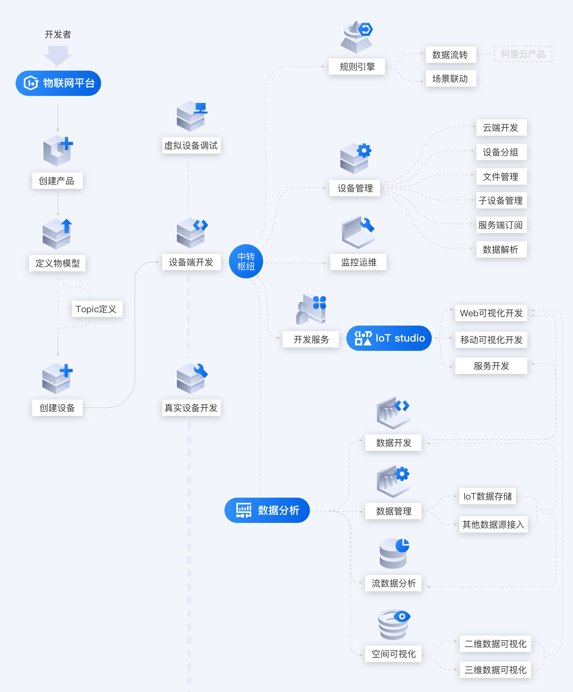
      
   产品架构   
   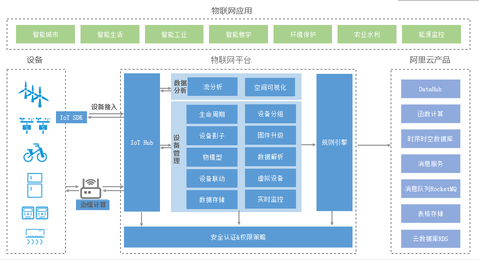 
   
   数据流转过程示意图
   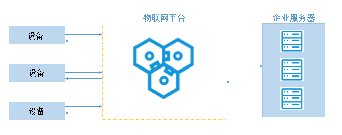 
   
   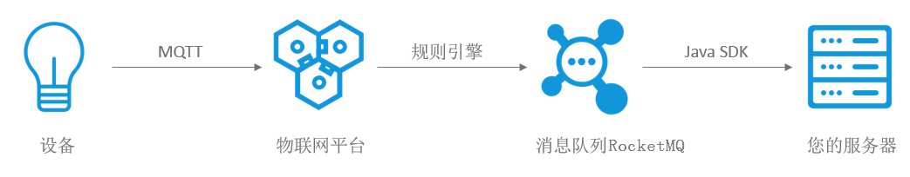 
   
   

## 

阿里云远程桌面 118.31.110.156 administrator admin@123

 

## 项目结构
  
        ----robot-server 项目根目录
        |
        |----robot-admin 后台管理模块
        |    |--db 存放admin模块需要的数据库文件
        |    |--src 源文件
        |    |....
        |----robot-agent 前置模块，sikulix封装
        |    |--src
        |       |--main
        |          |--build  agent模块构建相关
        |          |--java  源代码
        |          |--resources  资源文件
        |              |--Extensions sikulix 运行需要的插件
        |
        |----robot-api 
        |    |--db api模块需要的数据库文件
        |    |--src
        |       |--main
        |          |--build  模块构建相关
        |          |--java  源代码
        |          |--resources  资源文件
        |
        |----robot-common 公用模块
        |
        |----robot-generator 代码生成模块
        |
        |----SikuliX1-1.1.3 SikuliX1.1.3源代码
        |
        |----SikuliX1-1.1.4-master SikuliX1.1.4源代码 github拷贝下来的master分支（正在开发的分支，非稳定版本），拷贝时间是20190605，如果需要查看最新版本的源代码需要去GitHub上下载
                
   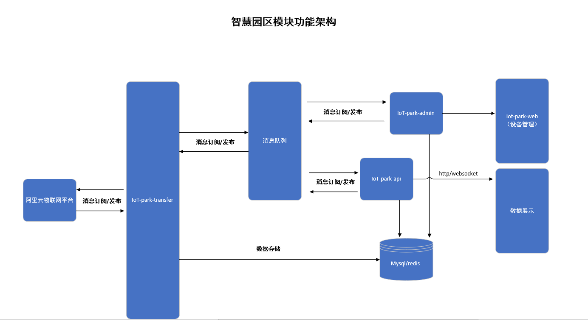
   
   
## 规范分支管理

   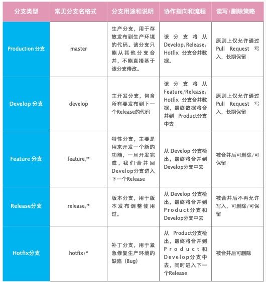
    
    灵活使用 Git tag 和发行版管理功能
       针对单个仓库协作可能存在分支数量增长的问题，提出通过 Git tag 来取代 release/* 版本分支的作用。
     *在 git 中，标签（tag）是特定提交（commit) 的一个指针，也就是每个 tag对应一个特定的 commit。release/* 系列分支在实质上就是合并到 Product
      (master) 分支上成为一个特殊提交，所以 tag 的存在使得没有必要保留release/* 分支。
     *另外，一般形如[码云]这样的 git代码托管平台，本身自带「发行版（Release）」功能。
     *通过 git本身只能记录项目的修改，而版本发布带来的项目构建物（特别是二进制文件）本身在某种意义上就不适合通过git 进行存储。
     *通过「发行版（Release）」功能，可以将对应版本的源代码和生成的项目构建物（比如exe/dmg）保存下来，还支持编写对应的 Changelog，便于查找下载。

     git教程：https://www.liaoxuefeng.com/wiki/896043488029600
## 注意事项

    1、每台服务器都需要在host 文件里面localhost的ip地址，因为activemq消息是topic类型的，subscriber接收到消息后需要通过ip
       来判断是否在本机上面执行
    2、robot-agent的resource文件夹里的Sikulix 里面如果没有Extensions、Lib ，那就自行把Extensions.zip、Lib.zip
       解压到resources\Sikulix
   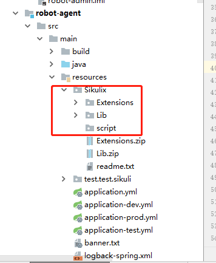 
    
    3、
  
  
### robot-agent

      技术栈：
      1、springboot 基础框架
      2、SikuliX1.1.3 流程自动化
      3、netty 客户端和服务端数据实时传输
      4、activemq
      
      
      jython ，sikulix运行python脚本时候需要
      
      sikulix运行是参数设置
         由于是集成定制开发sikulix，所以在开发的时候，经常会遇到sikulix单机运行没有问题，集成到项目里面使用的时候就会出现问题，这些问题有
      一大部分原因就是因为sikulix启动时候的系统参数问题。
        详细请查看启动类AgentApplication的initSystemProperty
      
      首次运行安装jar：
         C:\Users\Administrator\AppData\Roaming\Sikulix 中没有Lib和Extensions 文件夹或者为空，则需要安装jar包(com.szzt.iot.RunSetup)
         1.1.3版本在安装的时候，会下载相关的包到C:\Users\Administrator\AppData\Roaming\Sikulix 目录下，所以需要把相关的文件拷贝到这个目录下面，主要是
      Lib和Extensions
      
      执行流程json格式：
        [{
            "script_id": 1,
            "script_name": "脚本1",
            "is_local": true,
            "address_ip ": "127.0.0.1",
            "previous_script": 0,
            "next_script": [{
                    "script_id": 1,
                    "script_name": "脚本1",
                    "is_local": true,
                    "address_ip ": "127.0.0.1",
                    "previous_script": 1,
                    "next_script": [{
                        "script_id": 2,
                        "script_name": "脚本1",
                        "is_local": true,
                        "address_ip ": "127.0.0.1",
                        "previous_script": 1,
                        "next_script": []
                    }]
                },
                {
                    "script_id": 3,
                    "script_name": "脚本3",
                    "is_local": false,
                    "address_ip ": "192.168.12.18",
                    "previous_script": 1,
                    "next_script": []
                }
            ]
        }]
      
     
        
### robot-admin
     
      技术栈：
      1、springboot 基础框架
      2、mysql 5.7
      3、MyBatis
      4、Shiro框架
      5、Quartz
      6、redis
      7、activemq
      基础功能：用户管理、角色管理、部门管理、菜单管理、定时任务、参数管理、字典管理、文件上传、系统日志、文章管理等功能。
      其中，还拥有多数据源、数据权限、Redis缓存动态开启与关闭、统一异常处理等技术
      
### robot-generator

      代码生成器,通过连接数据库，生成与项目配套的代码，减少部分开发工作量
      1、修改application.yml 的数据库连接信息
      2、修改generator.properties 的配置信息
      3、com.szzt.iot.GeneratorApplication main方法启动
      4、生成代码后，把自己需要的代码拷贝到项目里面，有报错的地方，做适应性修改即可
      
   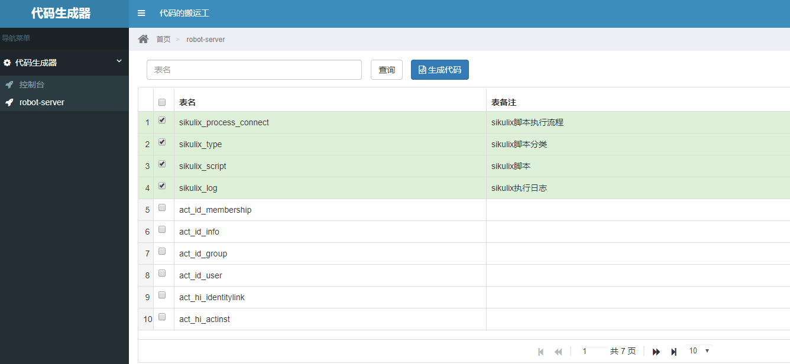
      

### 开发环境账号

     开发环境，需要连接长沙云谷vpn
     iot-park-admin服务器地址：
      ip:172.20.31.41
      账号：root
      密码：Cszt!2017
     Rabbitmq：
      ip:172.20.31.41
      账号：admin
      密码：admin
     msyql 
      ip:172.20.31.32
      账号：
      密码：
     redis 
      ip:172.20.31.32
      账号：
      密码：
     
     ps:连接不上开发环境的，请自行在自己电脑上面搭建运行环境
     

## 环境安装

### jdk1.8 安装

### Nginx 1.16.1 安装

### Rabbitmq 3.5.6-1 安装

    1、http://activemq.apache.org/components/classic/download/ 下载activemq
   
   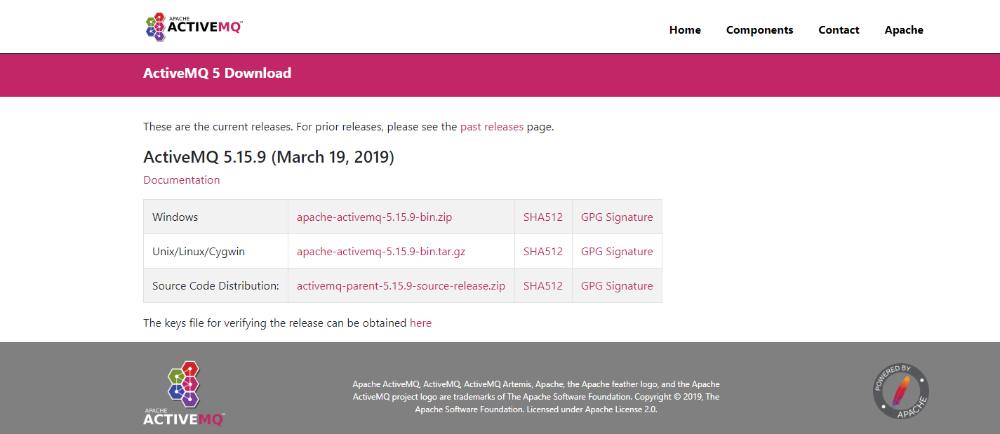
   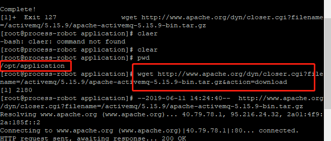
   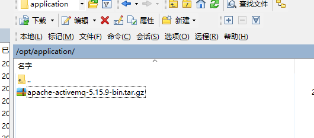
   
    2、解压安装
    cd /opt/application
    tar -xzvf apache-activemq-5.15.9-bin.tar.gz
    3、在/etc/init.d/目录增加增加activemq文件，文件内容为：
      cd /etc/init.d/
      vi activemq
      
        #!/bin/sh
        #
        # /etc/init.d/activemq
        # chkconfig: 345 63 37
        # description: activemq servlet container.
        # processname: activemq 5.15.9
         
        # Source function library.
        #. /etc/init.d/functions
        # source networking configuration.
        #. /etc/sysconfig/network
         
        export JAVA_HOME=/op
        export CATALINA_HOME=/opt/application/apache-activemq-5.15.9
         
        case $1 in
            start)
                sh $CATALINA_HOME/bin/activemq start
            ;;
            stop)
                sh $CATALINA_HOME/bin/activemq stop
            ;;
            restart)
                sh $CATALINA_HOME/bin/activemq stop
                sleep 1
                sh $CATALINA_HOME/bin/activemq start
            ;;
         
        esac
        exit 0
    4、文件授权 
      chmod 777 activemq
    5、设置开机启动并启动activemq
      chkconfig activemq on
      service activemq start
      
      访问地址：http://IP地址:8161/
      默认用户名密码为：admin/admin

    

### mysql5.7数据库安装

### redis 安装

### maven安装配置（开发环境需要）
      
### 云池
  工单处理-成分-02参数优化-01方案制作-登录账号-201906251606-zhanghao1-zhanghao2.xlsx
  名称不能有中文字符（目前还没法解决中文参数传递问题），不能有空格，空格用&代替
  工单名称示例：
  gongdanchuli-chengfen-02canshuyouhua-01fanganzhizuo-201906251606-dy_zhanghao1-dy_zhanghao2.xlsx
  gdcl-cf-02csyh-01fazz-201906251606-dy_zhanghao1-dy_zhanghao2.xlsx
   
   10.110.63.194: agent 10.110.63.124: admin activemq
  mysql monitor redis
    
    
    194 需要开启端口 8081
    124 需要开启端口 8080（robot-admin）、61616（activemq）、801（nginx）
    199 ftp 服务器
    hosts配置（C:\Windows\System32\drivers\etc\hosts）
    
    10.110.63.124  pro-robot-activemq
    10.110.63.124  pro-robot-mysql
    10.110.63.124  pro-robot-redis
    
    每台机器都要配置 localhost，把自己的ip配置好，比如124服务器
    10.110.63.124    localhost
    
    web 代码放在10.110.63.124：   C:\nginx-1.16.0\html
    mysql未设置密码
    
    Nginx 配置
    
    server {
    listen       80;
    server_name  localhost;

    #charset koi8-r;
    #access_log  /var/log/nginx/host.access.log  main;

    location / {
        root   /usr/share/nginx/html;
        index  index.html index.htm;
    }
   location /dev/robot-server/{
		proxy_set_header Host $host;
		proxy_set_header X-Real-IP $remote_addr;            
		proxy_set_header X-Forwarded-For $proxy_add_x_forwarded_for;
                proxy_cookie_path /aibot-api /;
                proxy_set_header Cookie $http_cookie;
		proxy_pass http://127.0.0.1:8080/robot-server/;
                
	}
	}

